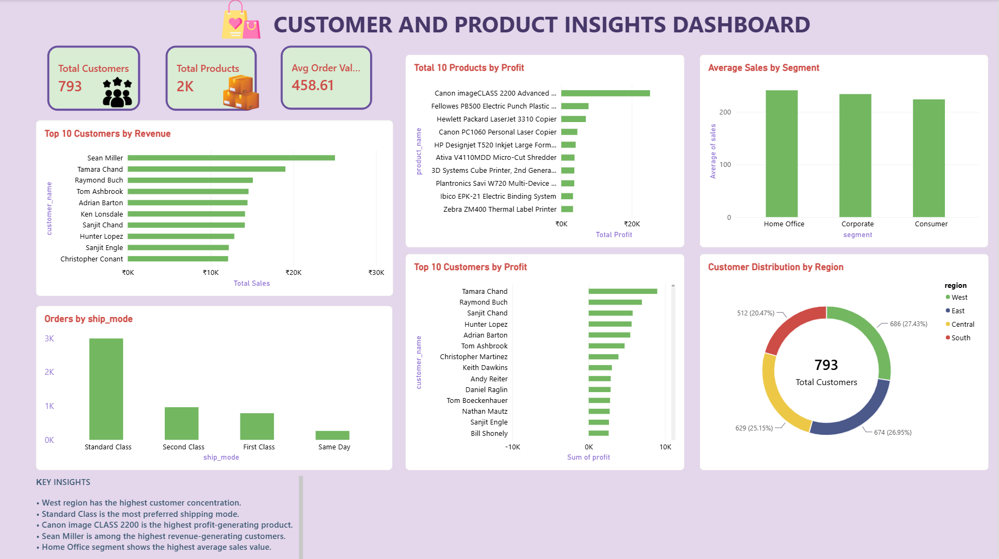

# Superstore Sales Analysis

End-to-end data analytics project using Excel, MySQL and Power BI.

## Tools Used
- *Excel*: data cleaning and initial analysis
- *MySQL*: database creation and business queries
- *Power BI*: interactive dashboard

## Project Structure
- Dataset/: Superstore Excel data
- SQL/: database setup and analysis queries
- PowerBI/: dashboard file and screenshots

## Dashboard Preview

## Key Insights

- West region has the highest customer concentration.

- Standard Class is the most preferred shipping mode.

- Canon imageCLASS 2200 is the highest profit-generating product.
  
- Sean Miller is among the highest revenue-generating customers.
  
- Home Office segment shows the highest average sales value.
